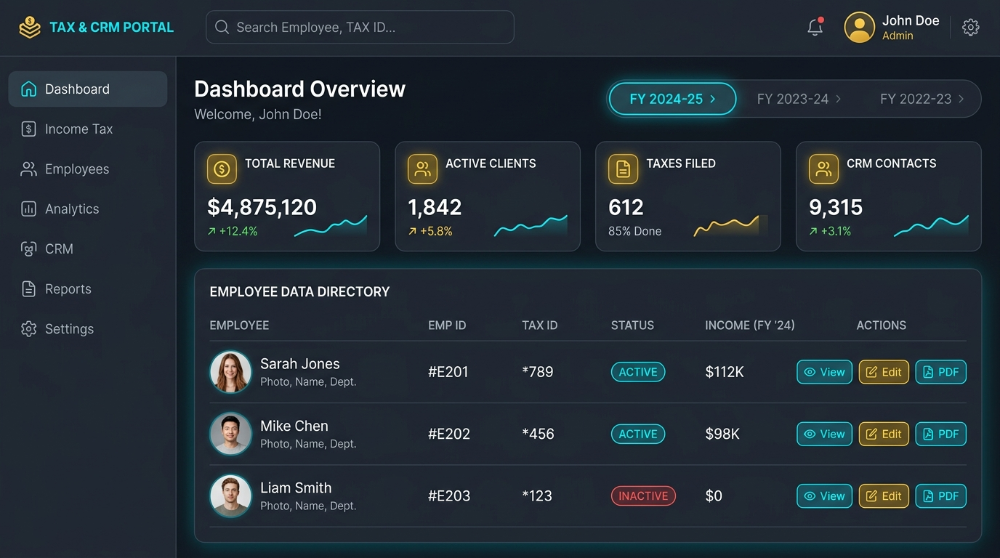
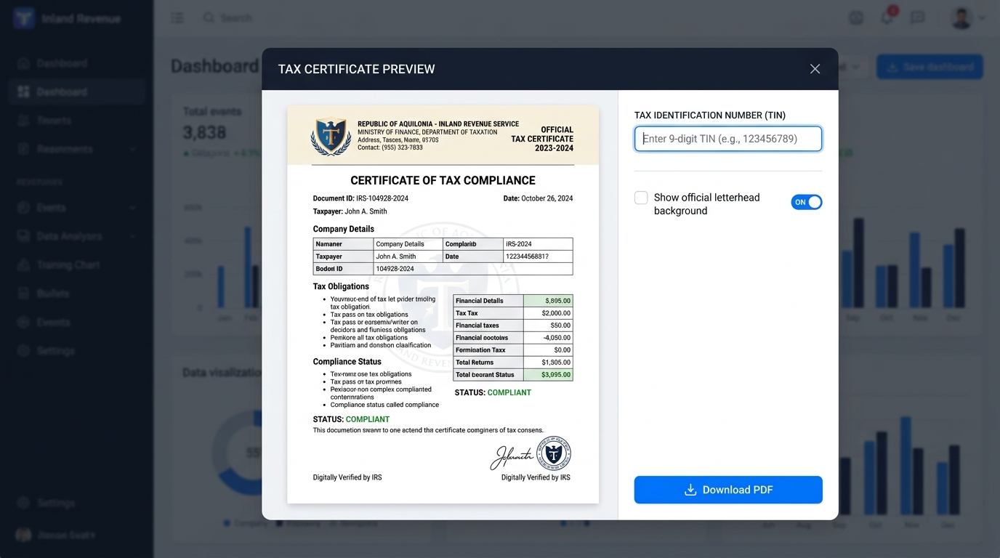

# 📑 Tax Statement Portal
> **Income Tax Statement & CRM System**  
> *Official Tax Certificate Generation & Payroll Audit Platform for BRAC Institute of Educational Development (BRAC IED), BRAC University.*

---

## 📸 Application Screenshots

### 📊 Dashboard Overview & Active Fiscal Year Hub


---

### 📄 In-Browser PDF Live Certificate Preview & Letterhead BG Mode


---

## 🌟 Key Features

- 📅 **Multi-Fiscal Year Data Hub**: Multi-tenant SQLite persistence capable of managing salary databases and tax challans per fiscal year (`2024-2025`, `2025-2026`, etc.) with zero data overwriting.
- 📄 **In-Browser PDF Certificate Engine**: Instant ReportLab PDF generation with optional **📜 Official Letterhead Background** mode for official email dispatch and printing.
- 🔍 **Data Audit Inspector**: Automated verification for unmatched PINs, missing tax challans, and salary anomalies. Automatically excludes non-faults (e.g., missing TINs or missing employee names).
- ✏️ **Inline TIN Edit & Interceptor**: Live TIN updating with an interactive missing TIN prompt modal that intercepts PDF generation when an employee lacks a TIN.
- 📊 **12-Month Salary Breakdown**: Detailed month-by-month breakdown (July to June) in employee details drawer.
- 👑 **User Account & Access Control**: Multi-role support with Admin user management (`PUT /api/users/<username>`) and self-service profile updates.

---

## 🛠️ Technology Stack

- **Core Backend**: Python 3.12, Flask 3.0+
- **WSGI Server**: Gunicorn 23.0+
- **Database**: SQLite3 (with WAL Write-Ahead Logging & B-Tree indexing)
- **PDF Engine**: ReportLab Platypus
- **Frontend**: HTML5, Vanilla CSS Design System, JavaScript (Fetch API)

---

## 🚀 Quick Start & Local Setup

### 1. Clone the Repository
```bash
git clone https://github.com/khanwasik1449/Income-Tax-Generator.git
cd Income-Tax-Generator
```

### 2. Install Dependencies
```bash
pip install -r requirements.txt
```

### 3. Run the Development Server
```bash
python app.py
```
Open your browser and navigate to `http://localhost:5000`.

---

## 🛡️ Production Deployment (Gunicorn + Systemd)

To run the application in production as a background service:

```bash
gunicorn app:app -b 0.0.0.0:80 -w 2 --timeout 120
```

---

## 🔒 Security & Data Privacy

By default, the `.gitignore` configuration excludes all sensitive datasets, databases (`data/app.db`), user credentials (`users.json`), uploaded CSV/Excel files, and log files from version control.

---

## ✍️ Author & Credits

- **Developer**: Wasik Ahmed Khan ([wasik.ahmed@brac.net](mailto:wasik.ahmed@brac.net))
- **Institution**: BRAC Institute of Educational Development (BRAC IED)
